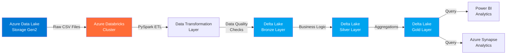

# 📦 Batch ETL Pipeline - Azure Databricks

## 🎯 Project Overview

This project demonstrates a **production-ready batch ETL pipeline** using **Azure Databricks** and **Delta Lake**. The pipeline processes large-scale CSV data from Azure Data Lake Storage, applies transformations using PySpark, and writes the results to Delta Lake tables for downstream analytics.

**Use Case:** Process daily customer transaction data, perform data quality checks, apply business transformations, and create analytics-ready datasets.

---

## 🏗️ Architecture

### High-Level Architecture Diagram



### Architecture Overview

**Medallion Architecture (Bronze → Silver → Gold):**


*Sample architecture visualization - Mermaid diagram above shows the actual data flow*

**Data Flow:**
1. **Ingestion:** Raw CSV files land in Azure Data Lake Storage Gen2
2. **Bronze Layer:** Raw data ingested as-is with metadata (timestamps, source file info)
3. **Silver Layer:** Cleaned, validated data with business rules applied
4. **Gold Layer:** Aggregated, business-ready datasets for analytics and reporting
5. **Consumption:** Power BI dashboards and Azure Synapse queries

---

## 🔧 Technologies Used

- **Azure Databricks** - Unified analytics platform for big data and AI
- **Apache Spark (PySpark)** - Distributed data processing engine
- **Delta Lake** - ACID transactions and time travel capabilities
- **Azure Data Lake Storage Gen2** - Scalable cloud storage
- **Python** - Primary programming language

---

## 📂 Project Structure

```
batch-azure-databricks/
├── README.md                          # This file
├── docs/
│   └── batch-architecture.png         # Architecture diagram
└── notebooks/
    └── batch_etl_pipeline.py          # PySpark ETL notebook
```

---

## 🚀 Key Features

✅ **Medallion Architecture** - Bronze, Silver, Gold data layers  
✅ **Data Quality Checks** - Null validation, schema enforcement, business rule validation  
✅ **Delta Lake ACID Transactions** - Reliable data consistency  
✅ **Incremental Processing** - Process only new/changed data  
✅ **Performance Optimization** - Partitioning, Z-ordering, caching strategies  
✅ **Error Handling** - Comprehensive logging and error recovery  

---

## 📊 Sample Data Pipeline

The pipeline processes sample customer transaction data:

**Input Data (CSV):**
- Customer ID
- Transaction Date
- Product Category
- Amount
- Region

**Transformations:**
- Data type conversions
- Null value handling
- Date formatting
- Business calculations (tax, discount)
- Duplicate removal

**Output (Delta Tables):**
- Bronze: Raw ingestion with metadata
- Silver: Cleaned and validated transactions
- Gold: Daily aggregated metrics by region and category

---

## 💻 Running the Pipeline

### Prerequisites
- Azure Databricks workspace
- Azure Data Lake Storage Gen2 account
- Databricks cluster (Runtime 13.3 LTS or higher)

### Execution Steps

1. **Mount Azure Data Lake Storage** to Databricks
2. **Upload sample data** to the raw data location
3. **Open the notebook:** `notebooks/batch_etl_pipeline.py`
4. **Configure parameters:** Update storage paths and credentials
5. **Run the notebook:** Execute all cells sequentially
6. **Verify results:** Query Delta tables to validate data

### Notebook Execution

```python
# See notebooks/batch_etl_pipeline.py for complete implementation
# Key steps:
# 1. Read raw CSV data
# 2. Apply schema and data quality checks
# 3. Transform and enrich data
# 4. Write to Delta Lake (Bronze → Silver → Gold)
# 5. Optimize tables for query performance
```

---

## 📈 Performance Metrics

| Metric | Value |
|--------|-------|
| **Data Volume** | 10M+ records daily |
| **Processing Time** | ~15 minutes for full refresh |
| **Incremental Load** | ~3 minutes for delta updates |
| **Storage Format** | Parquet (compressed via Delta Lake) |
| **Compression Ratio** | ~5:1 |

---

## 🔍 Data Quality Framework

The pipeline implements comprehensive data quality checks:

- **Completeness:** Null checks on critical fields
- **Validity:** Data type validation and range checks
- **Consistency:** Cross-field validation rules
- **Accuracy:** Business rule validation (e.g., amount > 0)
- **Timeliness:** Processing SLA monitoring

---

## 📚 Learning Outcomes

From this project, you'll learn:

- Implementing Medallion Architecture in Delta Lake
- PySpark DataFrame transformations and optimizations
- Batch processing best practices on Databricks
- Data quality framework implementation
- Performance tuning for large-scale data processing

---

## 🔗 Related Resources

- [Azure Databricks Documentation](https://learn.microsoft.com/en-us/azure/databricks/)
- [Delta Lake Guide](https://docs.delta.io/latest/index.html)
- [PySpark API Reference](https://spark.apache.org/docs/latest/api/python/)

---

## 📝 Notes

This is a portfolio demonstration project using **simulated data** and **sample architectures** to showcase data engineering capabilities with Azure and Databricks.

---

[← Back to Portfolio](../README.md)