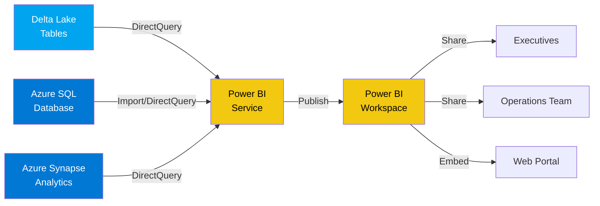

# 📊 Power BI Dashboards & Analytics - Azure Integration

## 🎯 Project Overview

This project showcases **interactive business intelligence dashboards** built with **Microsoft Power BI**, connected to Azure data services. The dashboards provide real-time insights into business metrics, with drill-down capabilities and advanced analytics.

**Use Case:** Create executive dashboards for sales analytics, operational metrics monitoring, and customer behavior analysis using data from Azure SQL Database, Azure Synapse Analytics, and Delta Lake.

---

## 🏗️ Architecture

### Data-to-Dashboard Architecture



### Dashboard Architecture

**Power BI Integration Architecture:**


*Sample dashboard visualization - Mermaid diagram above shows the data connection flow*

**Data Flow:**
1. **Data Sources:** Connect to Azure SQL, Synapse, and Delta Lake tables
2. **Power BI Desktop:** Design reports with visualizations and DAX calculations
3. **Power BI Service:** Publish and schedule data refreshes
4. **Distribution:** Share via workspaces, apps, and embedded reports
5. **Mobile:** Access dashboards on Power BI mobile apps

---

## 🔧 Technologies Used

- **Microsoft Power BI** - Business intelligence and visualization platform
- **DAX (Data Analysis Expressions)** - Formula language for calculations
- **Power Query M** - Data transformation language
- **Azure SQL Database** - Relational database for transactional data
- **Azure Synapse Analytics** - Data warehousing for analytics workloads
- **Delta Lake** - Data lake tables via Azure Databricks connector

---

## 📂 Project Structure

```
dashboards-azure/
├── README.md                          # This file
└── docs/
    └── dashboard-sample.png           # Sample dashboard screenshot
```

---

## 🚀 Key Features

✅ **Interactive Visualizations** - Charts, tables, maps, and custom visuals  
✅ **DirectQuery Mode** - Real-time data without import delays  
✅ **DAX Calculations** - Complex business logic and KPIs  
✅ **Row-Level Security** - Data access control by user roles  
✅ **Drill-Through Pages** - Detailed analysis from summary views  
✅ **Scheduled Refresh** - Automatic data updates (Import mode)  
✅ **Mobile Optimization** - Responsive layouts for mobile devices  
✅ **Embedded Analytics** - Integrate dashboards into web applications  

---

## 📊 Dashboard Examples

### 1. Executive Sales Dashboard

**Key Metrics:**
- Total Revenue (YTD, MTD, WTD)
- Sales by Region (Interactive map)
- Top 10 Products by Revenue
- Sales Trend Analysis (Time series)
- Customer Acquisition Rate

**Sample Dashboard:**


*Sample dashboard layout showing key business metrics*

**Visualizations:**
- Card visuals for KPIs
- Line chart for trend analysis
- Map visual for geographical distribution
- Bar chart for product rankings
- Slicer for date range selection

---

### 2. Operational Metrics Dashboard

**Key Metrics:**
- Real-time Event Processing Rate
- System Health Indicators
- Error Rate Monitoring
- Resource Utilization (CPU, Memory)
- Data Pipeline Status

**Features:**
- Auto-refresh every 5 minutes
- Alert indicators for threshold violations
- Drill-through to error details
- Time-based filtering

---

### 3. Customer Analytics Dashboard

**Key Metrics:**
- Customer Lifetime Value (CLV)
- Churn Rate Analysis
- Customer Segmentation
- Purchase Behavior Patterns
- Product Affinity Analysis

**Advanced Analytics:**
- Cohort analysis
- RFM (Recency, Frequency, Monetary) segmentation
- Predictive churn modeling
- Customer journey visualization

---

## 💻 Implementation Guide

### Prerequisites
- Power BI Desktop (latest version)
- Power BI Pro or Premium license
- Access to Azure data sources
- Azure AD authentication configured

### Connection Setup

#### 1. Connect to Azure SQL Database

```
Data Source:
- Server: your-server.database.windows.net
- Database: your-database
- Authentication: Azure Active Directory

Connection Mode:
- DirectQuery (for real-time) or Import (for better performance)
```

#### 2. Connect to Azure Synapse Analytics

```
Data Source:
- Server: your-synapse-workspace.sql.azuresynapse.net
- Database: your-sql-pool
- Authentication: Azure Active Directory

Recommended: DirectQuery for large datasets
```

#### 3. Connect to Delta Lake (via Databricks)

```
Install Connector:
- Azure Databricks connector for Power BI

Configuration:
- Server Hostname: your-databricks-workspace.azuredatabricks.net
- HTTP Path: /sql/1.0/warehouses/your-warehouse-id
- Authentication: Azure Active Directory or Personal Access Token
```

---

## 📈 DAX Calculations Examples

### Total Revenue
```dax
Total Revenue = 
SUM(Sales[Amount])
```

### Year-over-Year Growth
```dax
YoY Growth % = 
VAR CurrentYearRevenue = [Total Revenue]
VAR LastYearRevenue = 
    CALCULATE(
        [Total Revenue],
        SAMEPERIODLASTYEAR('Date'[Date])
    )
RETURN
    DIVIDE(
        CurrentYearRevenue - LastYearRevenue,
        LastYearRevenue,
        0
    )
```

### Customer Lifetime Value
```dax
Customer LTV = 
CALCULATE(
    SUM(Sales[Amount]),
    ALLEXCEPT(
        Sales,
        Sales[CustomerID]
    )
)
```

### Moving Average (3 months)
```dax
3-Month Moving Avg = 
CALCULATE(
    AVERAGE(Sales[Amount]),
    DATESINPERIOD(
        'Date'[Date],
        MAX('Date'[Date]),
        -3,
        MONTH
    )
)
```

### Top N Products Dynamic
```dax
Top N Products = 
VAR TopN = 10
VAR CurrentProduct = SELECTEDVALUE(Products[ProductName])
VAR RankOfProduct = 
    RANKX(
        ALL(Products[ProductName]),
        [Total Revenue],
        ,
        DESC,
        Dense
    )
RETURN
    IF(
        RankOfProduct <= TopN,
        [Total Revenue],
        BLANK()
    )
```

---

## 🎨 Visualization Best Practices

### Design Principles
1. **Keep it Simple**: Avoid clutter, focus on key insights
2. **Use Consistent Colors**: Follow brand guidelines and color theory
3. **Hierarchical Layout**: Most important metrics at the top
4. **White Space**: Don't overcrowd the canvas
5. **Interactivity**: Enable cross-filtering and drill-through

### Performance Optimization
1. **Reduce Visual Count**: Fewer visuals = faster rendering
2. **Aggregate Data**: Pre-aggregate in source when possible
3. **Use DirectQuery Wisely**: Balance real-time needs with performance
4. **Optimize DAX**: Avoid unnecessary calculations
5. **Filter Early**: Apply filters at data source level

---

## 📱 Mobile Experience

Power BI dashboards are automatically responsive, but for optimal mobile experience:

- **Create Phone Layout**: Custom layout for mobile devices
- **Simplify Visuals**: Fewer metrics on mobile views
- **Touch-Friendly**: Larger clickable areas
- **Portrait Orientation**: Design for vertical viewing
- **Test on Devices**: Verify on actual mobile devices

---

## 🔐 Security & Governance

### Row-Level Security (RLS)

```dax
[Region Security Rule] = 
[Region] = USERPRINCIPALNAME()
```

### Sensitivity Labels
- Confidential
- Internal Use Only
- Public

### Data Refresh Security
- Service Principal authentication
- Encrypted credentials in Azure Key Vault
- Gateway configuration for on-premises sources

---

## 📊 Performance Metrics

| Metric | Value |
|--------|-------|
| **Data Sources** | 3 (SQL, Synapse, Delta Lake) |
| **Dashboard Count** | 5 executive dashboards |
| **Refresh Frequency** | Every 1 hour (Import mode) |
| **Query Performance** | < 2 seconds (DirectQuery) |
| **Users** | 50+ active users |

---

## 🔗 Power BI Service Features

### Workspace Collaboration
- Shared workspace for team collaboration
- Role-based access (Admin, Member, Contributor, Viewer)
- Version control and deployment pipelines

### Scheduled Refresh
- Configure refresh schedule (up to 8x daily with Pro)
- Email notifications on refresh failure
- Incremental refresh for large datasets

### Embedded Analytics
```html
<!-- Embed Power BI report in web application -->
<iframe 
    width="800" 
    height="600" 
    src="https://app.powerbi.com/reportEmbed?..." 
    frameborder="0" 
    allowFullScreen="true">
</iframe>
```

---

## 📚 Learning Outcomes

From this project, you'll learn:

- Connecting Power BI to Azure data sources
- Creating interactive visualizations and dashboards
- Writing advanced DAX calculations
- Implementing row-level security
- Optimizing dashboard performance
- Publishing and sharing reports
- Mobile dashboard design
- Embedded analytics integration

---

## 🔗 Related Resources

- [Power BI Documentation](https://learn.microsoft.com/en-us/power-bi/)
- [DAX Guide](https://dax.guide/)
- [Power BI Best Practices](https://learn.microsoft.com/en-us/power-bi/guidance/)
- [Azure Synapse Connector](https://learn.microsoft.com/en-us/power-bi/connect-data/service-azure-sql-data-warehouse-with-direct-connect)

---

## 📈 Business Impact

**Before Power BI:**
- Manual report generation (2-3 days)
- Static Excel reports
- Limited data insights
- No real-time visibility

**After Power BI:**
- Self-service analytics (instant)
- Interactive dashboards
- Data-driven decisions
- Real-time operational monitoring

**ROI:** 
- 80% reduction in report generation time
- 50% faster decision-making
- Improved data accuracy
- Enhanced business visibility

---

## 📝 Notes

This is a portfolio demonstration project showcasing **Power BI dashboard design** and **Azure data integration** capabilities. Sample dashboard images and metrics are for illustration purposes.

For actual dashboard files (.pbix), they would require:
- Configured Azure data source connections
- Valid credentials and access permissions
- Power BI Desktop to view and edit
- Power BI Service license to publish

---

[← Back to Portfolio](../README.md)