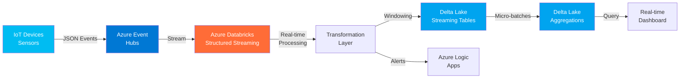

# 🌊 Real-Time Streaming Pipeline - Azure Event Hubs & Databricks

## 🎯 Project Overview

This project demonstrates a **real-time streaming data pipeline** using **Azure Event Hubs** and **Azure Databricks Structured Streaming**. The pipeline ingests IoT sensor events in real-time, processes them using PySpark Structured Streaming, and writes results to Delta Lake for immediate analytics.

**Use Case:** Process real-time IoT sensor data from manufacturing equipment, detect anomalies, calculate streaming aggregations, and trigger alerts for critical events.

---

## 🏗️ Architecture

### High-Level Architecture Diagram



### Architecture Overview

**Streaming Pipeline Architecture:**


*Sample streaming architecture visualization - Mermaid diagram above shows the actual event flow*

**Data Flow:**
1. **Event Generation:** IoT sensors emit JSON events to Azure Event Hubs
2. **Stream Ingestion:** Databricks connects to Event Hubs using structured streaming
3. **Real-time Processing:** Apply transformations, filtering, and enrichment
4. **Windowed Aggregations:** Calculate metrics over tumbling/sliding windows
5. **Persistence:** Write to Delta Lake with exactly-once semantics
6. **Consumption:** Real-time dashboards and alerting systems

---

## 🔧 Technologies Used

- **Azure Event Hubs** - Event ingestion service for millions of events per second
- **Azure Databricks Structured Streaming** - Scalable stream processing engine
- **Apache Spark (PySpark)** - Distributed stream processing
- **Delta Lake** - ACID transactions for streaming data
- **Python** - Primary programming language
- **Azure Logic Apps** - Event-driven alerting

---

## 📂 Project Structure

```
streaming-azure-databricks/
├── README.md                              # This file
├── docs/
│   └── streaming-architecture.png         # Architecture diagram
└── notebooks/
    └── streaming_etl_pipeline.py          # PySpark Structured Streaming notebook
```

---

## 🚀 Key Features

✅ **Real-Time Processing** - Sub-second latency for event processing  
✅ **Exactly-Once Semantics** - No duplicate processing with Delta Lake  
✅ **Windowed Aggregations** - Tumbling, sliding, and session windows  
✅ **Watermarking** - Handle late-arriving data gracefully  
✅ **Fault Tolerance** - Automatic checkpointing and recovery  
✅ **Scalability** - Auto-scaling based on event volume  
✅ **Anomaly Detection** - Real-time threshold monitoring and alerting  

---

## 📊 Sample Streaming Data

The pipeline processes IoT sensor events:

**Input Event (JSON):**
```json
{
  "sensor_id": "SENSOR001",
  "device_type": "temperature",
  "timestamp": "2024-11-12T10:30:45.123Z",
  "value": 72.5,
  "unit": "fahrenheit",
  "location": "warehouse-1",
  "status": "normal"
}
```

**Streaming Transformations:**
- Parse JSON events
- Timestamp extraction and formatting
- Data validation and filtering
- Anomaly detection (threshold checks)
- Enrichment with reference data
- Windowed aggregations (1-minute, 5-minute, 1-hour)

**Output (Delta Tables):**
- Raw streaming events with watermarking
- Real-time aggregated metrics by sensor and location
- Anomaly alerts for immediate action

---

## 💻 Running the Streaming Pipeline

### Prerequisites
- Azure Event Hubs namespace and hub
- Azure Databricks workspace
- Databricks cluster (Runtime 13.3 LTS or higher)
- Event Hubs connection string

### Setup Steps

1. **Configure Event Hubs:**
   - Create Event Hubs namespace in Azure Portal
   - Create an event hub (e.g., "sensor-events")
   - Note the connection string and event hub name

2. **Configure Databricks:**
   - Install Event Hubs library: `com.microsoft.azure:azure-eventhubs-spark_2.12:2.3.22`
   - Open the notebook: `notebooks/streaming_etl_pipeline.py`

3. **Update Configuration:**
   - Set Event Hubs connection string
   - Configure checkpoint location
   - Set Delta Lake output paths

4. **Run the Pipeline:**
   - Execute notebook cells sequentially
   - Monitor streaming query progress
   - Verify data in Delta tables

### Monitoring

```python
# Check streaming query status
streaming_query.status

# View streaming metrics
streaming_query.recentProgress

# Monitor throughput
streaming_query.lastProgress
```

---

## 📈 Performance Metrics

| Metric | Value |
|--------|-------|
| **Throughput** | 10,000+ events/second |
| **Latency** | < 500ms end-to-end |
| **Checkpoint Interval** | 10 seconds |
| **Window Duration** | 1 minute (configurable) |
| **Watermark Delay** | 10 seconds |

---

## 🎯 Windowing Strategies

The pipeline implements multiple windowing approaches:

### Tumbling Window (1 minute)
- Non-overlapping windows
- Used for: Basic aggregations per minute

### Sliding Window (5 minutes, slides every 1 minute)
- Overlapping windows
- Used for: Moving average calculations

### Session Window (10 minute timeout)
- Dynamic window based on event activity
- Used for: Detecting continuous sensor activity

---

## 🔍 Anomaly Detection

Real-time anomaly detection rules:

- **Temperature Threshold:** Alert if temperature > 100°F or < 32°F
- **Missing Data:** Alert if no events received for 5 minutes
- **Spike Detection:** Alert if value increases > 20% within 1 minute
- **Status Monitoring:** Alert on "error" or "critical" status

---

## 📚 Learning Outcomes

From this project, you'll learn:

- Implementing Structured Streaming with Event Hubs
- Windowed aggregations and watermarking strategies
- Exactly-once processing with Delta Lake
- Real-time anomaly detection patterns
- Streaming checkpoint management and recovery
- Performance tuning for high-throughput streams

---

## 🔗 Related Resources

- [Azure Event Hubs Documentation](https://learn.microsoft.com/en-us/azure/event-hubs/)
- [Databricks Structured Streaming Guide](https://docs.databricks.com/structured-streaming/)
- [Delta Lake Streaming](https://docs.delta.io/latest/delta-streaming.html)
- [Apache Spark Structured Streaming](https://spark.apache.org/docs/latest/structured-streaming-programming-guide.html)

---

## 🆚 Batch vs Streaming

| Aspect | Batch Pipeline | Streaming Pipeline |
|--------|---------------|-------------------|
| **Latency** | Minutes to hours | Sub-second to seconds |
| **Data Volume** | Large historical datasets | Continuous event streams |
| **Processing** | Scheduled (hourly/daily) | Continuous (24/7) |
| **Use Case** | Reports, analytics | Real-time monitoring, alerts |
| **Complexity** | Simpler | More complex (state, watermarks) |

---

## 📝 Notes

This is a portfolio demonstration project using **simulated IoT sensor data** and **sample architectures** to showcase real-time data engineering capabilities with Azure Event Hubs and Databricks.

---

[← Back to Portfolio](../README.md)